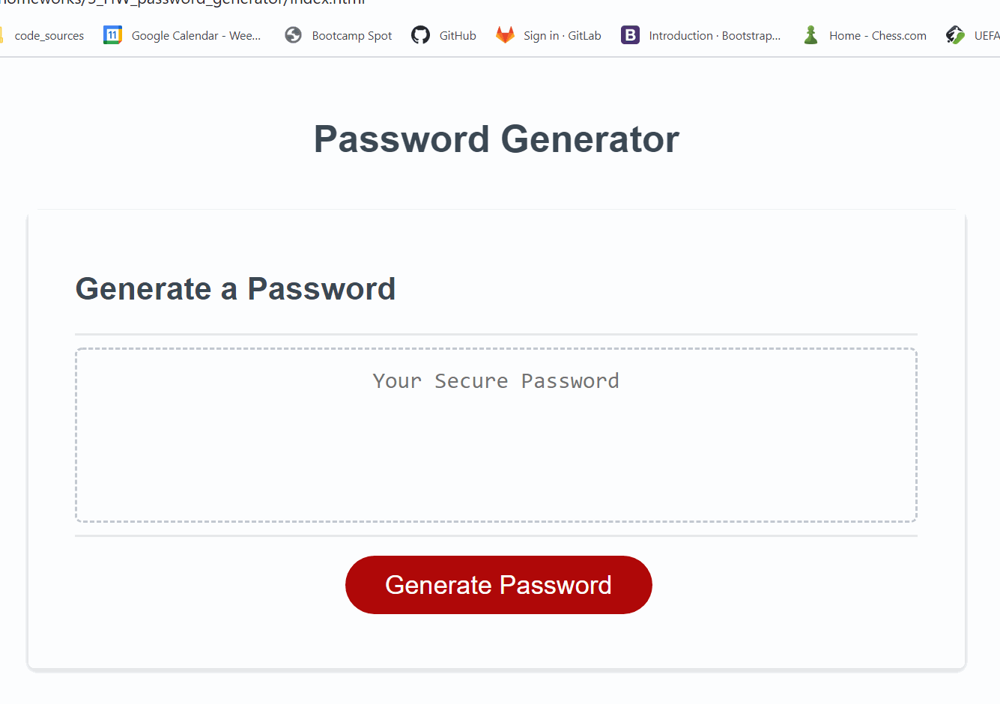

# Password_generator - [Deployed product](https://victorcodrean.github.io/3_HW_password_generator/)

# Table of Contents

- [Description](#Description)
- [Illustration of generated password](#Illustration)
- [Framework HTML/CSS/JS](#Framework)
- [Quick GoThrough](#Gothrough)
- [Credits](#Credits)

    

## Description
It's an Application that generates a random password based on user-selected criteria. The generated password it's created from different type of characters and character-length.
* Length range: 8-128 characters
* Available type of characters: (lowercase; uppercase; numbers & special characters/symbols).

## Illustration


## Framework
* HTML- Data & CSS - Presentation: was provided...
* JS - code:
    * Math.floor(Math.random()):
        ```
        var randomi = Math.floor(Math.random() * x.length);
        y += x[randomi];
        ```
    * while loops:
        ```
        while (condition || condition || condition) {
        alert();
        ...
        }
        ```
    * for loops:
        ```
        for (var; condition; increment...) {
            ...
        }
        ```
    * if statements:

## Gothrough
* WHEN I click the button to generate a password
* THEN I am presented with a series of prompts for password criteria
* WHEN prompted for the length of the password
* THEN I choose a length of at least 8 characters and no more than 128 characters
* WHEN prompted for character types to include in the password
* THEN I choose lowercase, uppercase, numeric, and/or special characters
* WHEN I answer each prompt
* THEN my input should be validated and at least one character type should be selected
* WHEN all prompts are answered
* THEN a password is generated that matches the selected criteria
* WHEN the password is generated
* THEN the password is either displayed in an alert or written to the page

## Credits
* List of the resources used to complete this project:
    * - [W3Schools](https://www.w3schools.com/) 
    * - [StackOverFlow](https://stackoverflow.com/)
    * - [MDN web docs](https://developer.mozilla.org/en-US/)
    * - [Git Hub](https://github.com/)

## Contributing
* Name: Victor Codrean
* [Email](CodreanVictor@gmail.com)
* [GitHub](https://github.com/VictorCodrean)

## Directory
* [Deployed Website](https://victorcodrean.github.io/3_HW_password_generator/)
* [GitHub Source](https://github.com/VictorCodrean/3_HW_password_generator)